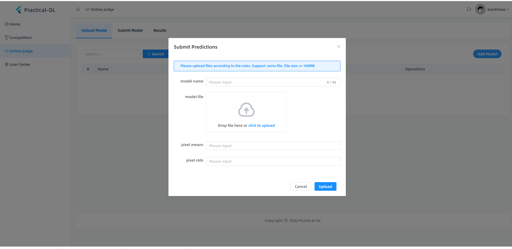

# Practical AI Challenge at AAAI 2023
For full challenge details, please see the [AAAI2023 Practical AI challenge](https://practical-dl.sensecore.cn/#/intro) page.

For general questions regarding this challenge, you can join the group via Slack or WeChat.🤗

Slack: Join by clicking [this link](https://join.slack.com/t/w1666859556-fgw388026/shared_invite/zt-1iyl8cqq8-PnRCgvLEht9oVr9tA4KMmg).

WeChat: Join by scanning the following QR code.

## [Train Example](./train.md)

## Submitting

After exporting the onnxfile, submit your onnxfile to [online judge](https://practical-dl.sensecore.cn/#/onlineJudge) to get your scores.

## [OpenI Platform Example](./openI.md)