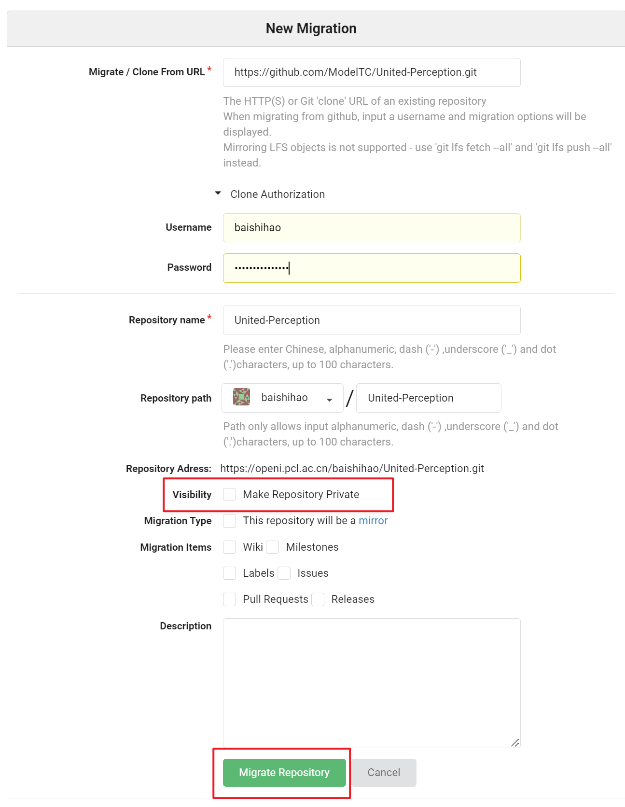
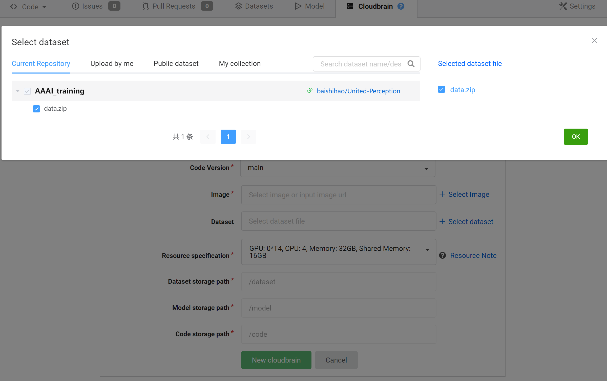

## OpenI Platform

We provide training resources for participants on the OpenI platform where the participants can use two v100 to train their models. If you want to use the GPUs we provided,  please register your account in https://openi.org.cn/  and submit your username and mails to [here](https://docs.qq.com/sheet/DT0taRGNzRkFzbFNa?tab=BB08J2).  You can check if you have successfully enabled the permission [here](https://openi.pcl.ac.cn/AAAI2023).

**1. migrate the code from github**

You can migrate the  [United-Perception](https://github.com/ModelTC/United-Perception/tree/main/up)  repo to openi as follows and we recommend that you switch to the AAAI_challenge branch, which is specially prepared for the OpenI platform.

**2. build your dataset**

You can build your own datasets by associating datasets we provided.

**3. Debug and Train**

**3.1 Debug**

The OpenI provides convenient debugging and training functions. Participants can debug their code by following the steps below.

You can choose your most similar tools to debug your code.

**3.2 Train**

During training, your code is saved in `/tmp/code/` by default, datasets are saved in `/tmp/dataset/` by default, and the outputs is saved in `/tmp/output/` by default. More details can be seen [here](https://openi.pcl.ac.cn/resource_desc). You can follow these steps to train your model.

The training Image is：`dockerhub.pcl.ac.cn:5000/user-images/openi:1.3.0`

You can view the training results and download the model files here.

