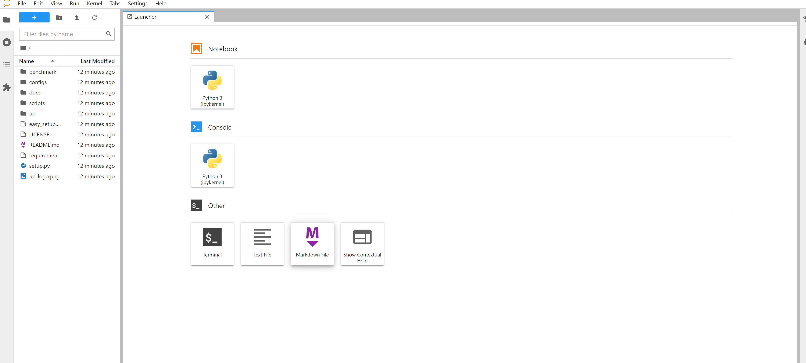

## OpenI Platform

We provide training resources for participants on the OpenI platform where the participants can use two v100 or A100 to train their models.

**1. migrate the code from github**

You can first register your account in https://openi.org.cn/ and migrate the  [United-Perception](https://github.com/ModelTC/United-Perception/tree/main/up)  repo to openi as follows:

**2. build your dataset**

You can build your own datasets by associating datasets we provided.

**3. Debug and Train**

The OpenI provides convenient debugging and training functions. Participants can debug their code by following the steps below.

You can choose your most similar tools to debug your code.

